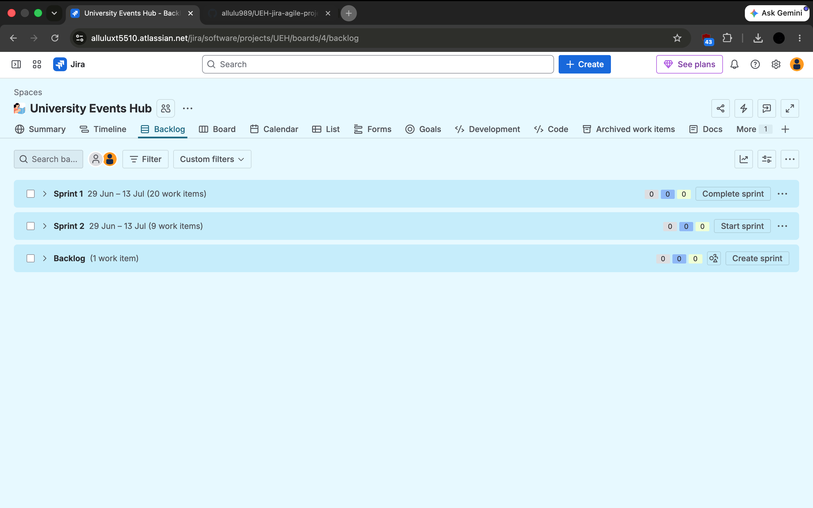
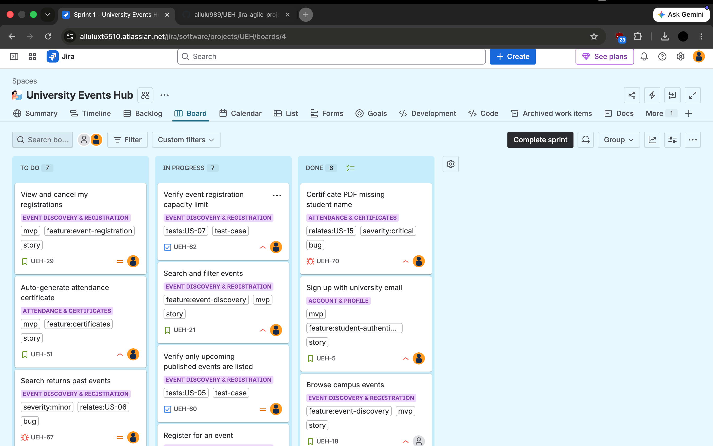
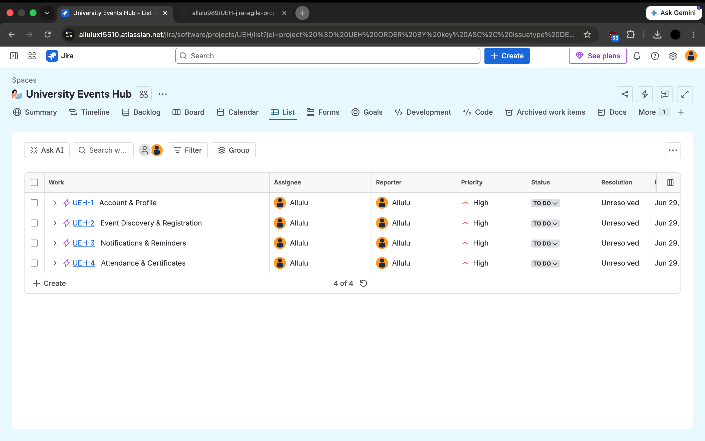
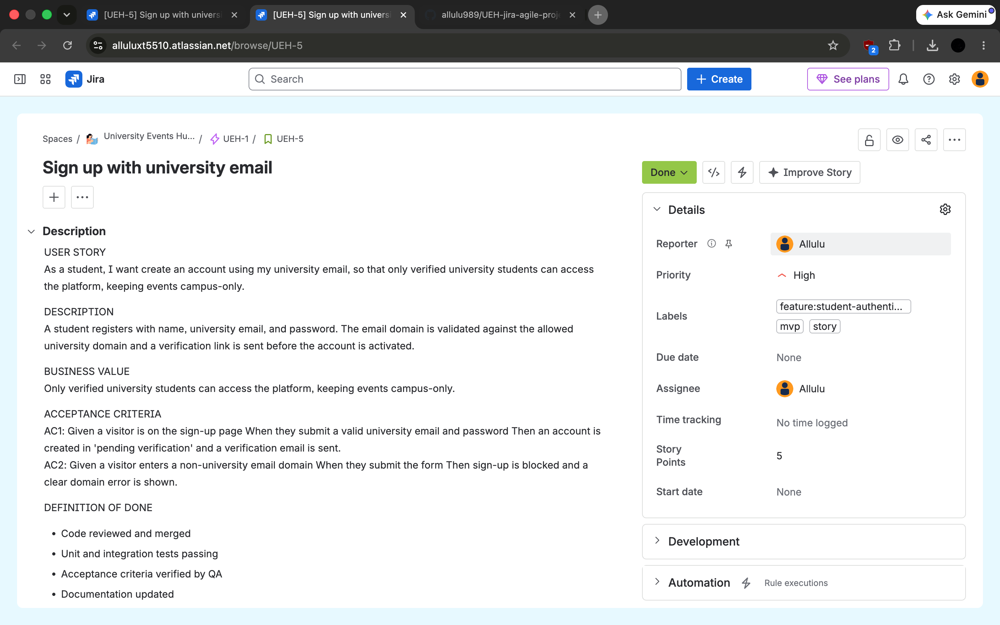
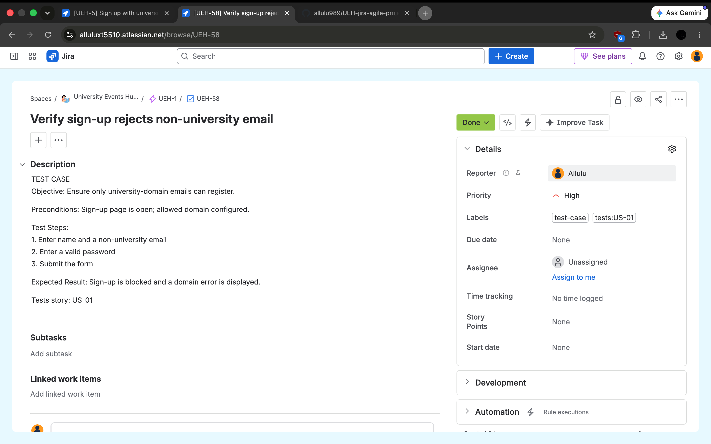
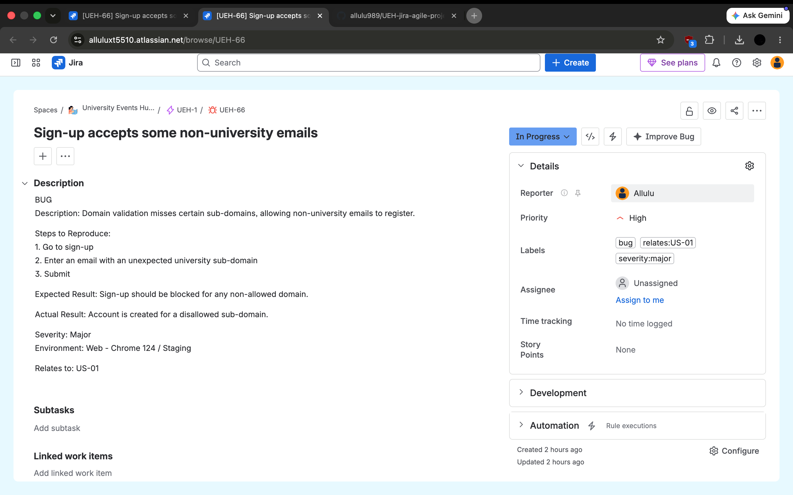

# 🎓 University Events Hub

> A complete Agile Scrum project created in Jira to simulate a real-world software development lifecycle from Business Analysis through Sprint Planning, Quality Assurance, and Defect Tracking.


---

# 📌 Overview

University Events Hub is a simulated software product designed to help university students discover campus events, register online, receive reminders, check in using QR codes, and automatically receive attendance certificates.

The project was created to demonstrate practical experience using **Jira Software** while applying **Agile Scrum**, **Business Analysis**, **Product Management**, and **Quality Assurance** practices.

Rather than focusing on software development, this project focuses on how a real Agile team manages product requirements, sprint planning, testing, and issue tracking.

---

# 🎯 Business Problem

University students often receive event announcements through scattered communication channels such as emails, WhatsApp groups, and posters.

This causes:

- Missed events
- Poor attendance
- Manual registration
- No reminder system
- Manual certificate generation

University Events Hub centralizes the entire journey into one platform.

---

# 🚀 Product Goal

Create one platform where students can:

✅ Browse campus events

✅ Register online

✅ Receive reminders

✅ Check in using QR codes

✅ Download attendance certificates

---

# 🛠 Tech & Methodology

- Jira Software
- Agile Methodology
- Scrum Framework
- Product Backlog
- Sprint Planning
- User Stories
- Acceptance Criteria
- Story Points
- Test Cases
- Bug Tracking
- Priority & Severity Management

---

# 📂 Project Structure

```
Project
│
├── Epic
│     ├── Feature
│     │      ├── User Story
│     │      │       ├── Sub-task
│     │      │       ├── Test Case
│     │      │       └── Bug
```

---

# 📋 Epics

### 1. Account & Profile

- Student Registration
- Login
- Password Reset
- Profile Management

---

### 2. Event Discovery & Registration

- Browse Events
- Search & Filter
- Event Registration
- Registration Management

---

### 3. Notifications & Reminders

- Event Reminder
- Notification Center
- Notification Preferences

---

### 4. Attendance & Certificates

- QR Check-in
- Manual Attendance
- Certificate Generation
- Certificate Download

---

# 🏃 Scrum Implementation

The project follows Scrum using two 2-week sprints.

## Sprint 1 (MVP)

Focused on delivering the complete end-to-end student journey.

Included:

- Sign Up
- Login
- Browse Events
- Search Events
- Register
- QR Check-in
- Certificate Generation

---

## Sprint 2

Focused on enhancements.

Included:

- Profile Management
- Notifications
- Manual Attendance
- Certificate Download

---

# 🧪 Quality Assurance

The project also demonstrates QA activities including:

- Test Case creation
- Defect reporting
- Priority assignment
- Severity classification
- Traceability between Stories, Test Cases and Bugs

Example traceability:

```
User Story

↓

Test Case

↓

Bug

↓

Fix

↓

Re-test
```

---

# 📊 Jira Workflow

Every issue follows the workflow below:

```
To Do

↓

In Progress

↓

In Review

↓

Done
```

---

# 📸 Jira Screenshots

## Product Backlog



---

## Sprint Board



---

## Epic Example



---

## User Story



---

## Test Case



---

## Bug Report



---

# 📄 Documentation

This repository also includes supporting documentation created for the project.

- Project Scope
- Agile Process Guide

---

# 💡 Skills Demonstrated

Business Analysis

- Requirements Gathering
- User Story Writing
- Acceptance Criteria
- Functional Requirements
- Non-functional Requirements

Agile

- Scrum
- Sprint Planning
- Product Backlog
- Story Point Estimation

Quality Assurance

- Test Cases
- Bug Reporting
- Priority
- Severity
- Defect Lifecycle

Jira

- Epics
- Stories
- Sub-tasks
- Issue Linking
- Labels
- Workflow Management

---

# 📚 Learning Outcome

Through this project I practiced how Business Analysts, Product Owners, Developers, and QA engineers collaborate using Jira throughout an Agile software development lifecycle.

The project demonstrates practical experience with backlog management, sprint planning, requirement decomposition, issue tracking, testing, and defect management.

---

## 👤 Author

**Allulu Alkheraiji**

Business Analysis • Product Management • Quality Assurance
